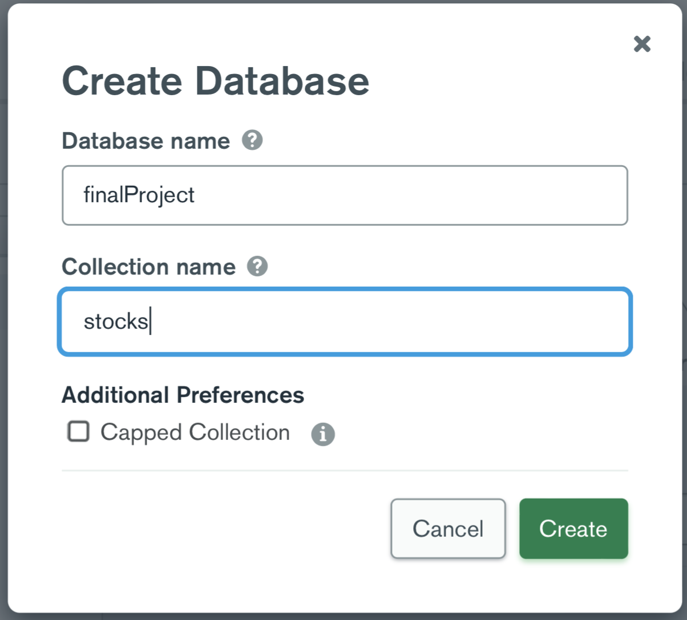

# POS 點餐機

第 54 組，由黃嘉宏、周俊廷、陳君翰共同設計與開發

## 安裝與執行

1. clone GitHub repository，進入`final/`目錄
2. 下載套件
   1. 於`final/`目錄執行`yarn install`
   2. 於`final/frontend`目錄執行`yarn install`
   3. 於`final/backend`目錄執行`yarn install`
3. 設定後端資料庫

   1. 請在`final/backend`目錄新增`.env`檔案，並可參考`.env.default`操作
   2. 到 MongoDB Atlas 的網站，利用之前創好的 cluster，在裡面新增一個 database

      

   3. 於`.env`檔案中，新增一行`MONGO_URL=`，並在其後貼上合理的 MongoDB Atlas 資料庫的連結網址
   4. 於`.env`檔案中，新增一行`TEST=`。若為`TEST=true`，只要每次重新執行後端，資料庫將被`upload.js`中的測試資料覆蓋，原資料會消失；反之，若為`TEST=false`，則資料庫不受影響

4. 執行程式碼
   1. 執行前端：打開 terminal／cmd，於`final/`目錄執行`yarn start`
   2. 執行後端：打開 terminal／cmd，於`final/`目錄執行`yarn server`
   3. 前端將會是  `http://localhost:3000`, 後端則是  `http://localhost:5000`

## 服務介紹

我們的服務是 POS(Point of Sale)點餐系統，目的是使各個社團、系所在進行「xx 週」的活動時，能更容易掌握銷貨數據，並希望以此協助會計人員能夠更好的記帳，並協助活動負責人更容易決定銷售品項與數量、調整品項與價格、調整人力資源分配。

此系統有前台和後台，前台用於服務生點餐，後台用於管理員監測庫存、增減商品、盤點銷貨、增減用戶等。

## 功能與測試

### 登入頁面

須使用正確的帳號和密碼才能登入

請以以下資料進行測試：管理員帳號 “admin”，管理員密碼”0000”。服務生帳號”clerk1”，服務生密碼”haha”

### 管理員頁面

1. Header

   更改密碼、登出

2. 庫存介面
   - 檢視現有商品庫存
   - 新增或刪除商品。若欲新增同名商品則會失敗。
   - 更新產品資訊。可以更改的項目有：名稱、類別、價格、成本、剩餘數量。
   - 查看不同類型商品的庫存
3. 營收介面

   輸入開始時間和截止時間，即可取得這段期間的各項營收資訊。包含：產品名稱、賣出數量、產品總成本、產品總收入、產品總利潤、及期間總利潤。

4. 用戶管理介面
   - 新增、刪除用戶
   - 更改用戶權限

### 收銀員頁面

1. Header

   更改密碼、登出

2. 右側點餐區
   - 切換到不同類型的商品
   - 選擇商品並輸入數量
   - 商品剩餘數量會隨訂單而改變，若商品剩餘數為零則無法選擇
3. 左側購物車
   - 點按購物車內商品則可刪除該項紀錄
   - 刪除全部訂單、送出訂單

### 測試注意事項

1. 由於使用 antd, material UI 等第三方模組，於某些系統、瀏覽器運行時可能會有相容性問題而導致出錯，建議使用 Chrome, Firefox 進行測試，但仍有出錯之可能性
2. 目前尚不支持即時主動同步更新資料給其他用戶，請不要多人使用

## 組員負責項目

三位組員皆是修課學生，實作內容都是從零開始做起，並沒有使用本課程以外的資料或 project，也沒有請外人幫忙

黃嘉宏 資工四 B07902077：Manager 前端介面，部分 deploy

周俊廷 資工四 B07902091：後端，部分 Cashier 前端介面，部分 deploy

陳君翰 資工四 B07902059：部分 Cashier 前端介面，題目發想與設計，報告撰寫與錄影

## 組員心得

1. 黃嘉宏：我負責前端 Manager 的部分，Manager 的介面共有三個主頁面、各種跳轉功能，因此我花了大部分時間在設計整個頁面的流程、確認 setState 傳遞和 Router 架構等頁面跳轉。期末專案大大提升我對 React Hook 熟悉程度以及全端開發的流程，獲益良多。
2. 周俊廷：我主要負責的是後端 Server-Database 的部分。在後端上，由於需要確保資料都存到資料庫後，使用了大量的 async-await。在使用 await 時意外的發現如果 await 無法被使用於沒有回傳 return 的 function 上，這是在課堂上沒發現到的。之後我還有輔助一部分前端 Cashier，提供基礎的程式碼的建議，如設定那些 hook，handler，在 return 裏怎麽使用這些 hook，handler 等等。最後則是，將服務通過 GCP 的 VM Instance 部署到雲端上。期末專案幫助我將課程上學到的知識都復習，熟悉了一遍，也額外查詢了 GCP 如何運作以及對一個專案、服務的建立、規劃與實現的過程有了更深的瞭解。
3. 陳君翰：我負責前端 Cashier 的部分，整體概念並不難，但缺乏第三方模組，使得我耗費大量時間調整美觀與功能，使我切身感受到第三方模組的好處。此外，我感受到自己在 React Hook 和動態畫面生成上的能力仍非常不足，非常感謝其他兩名組員的協助，我學習到了很多。

## 檢討與未來展望

由於在事前設計時考慮不周，前後端的連結是單純使用 http RESTful API，並沒有使用 websocket，因此無法即時更新資料給其他用戶，這部分的程序性錯誤將在未來調整。

除此之外，我們也希望能增加更多新功能，例如新增後台廚房的介面，使收銀員和備餐人員之間的溝通能更順暢，又例如套餐的定義、折扣的計算，這部分在整體網頁設計和記帳流程都會增加很多的困難，希望能持續構思突破，讓這份 project 有永續生存的可能。

## 使用框架與模組

### Frontend

框架：reactJS

模組：antd、Material-UI、axios、react、react-dom、react-router-dom、react-scripts、styled-components

### Backend

框架：NodeJS

模組：connect-mongodb-session、cors、dotenv-defaults、express、express-session、mongoose、nodemon
